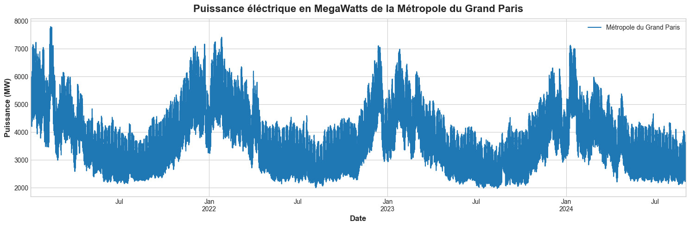
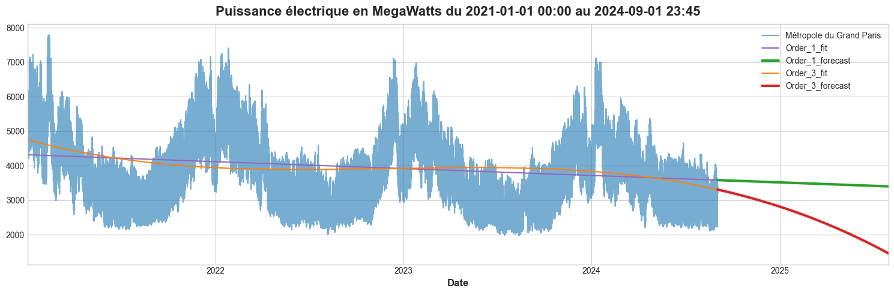
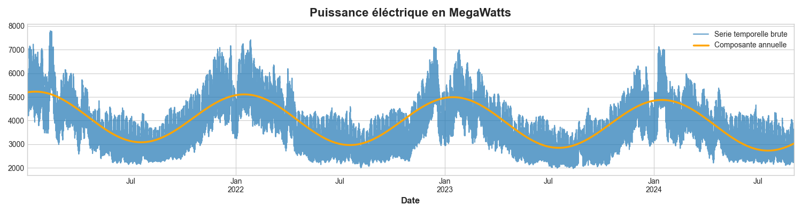
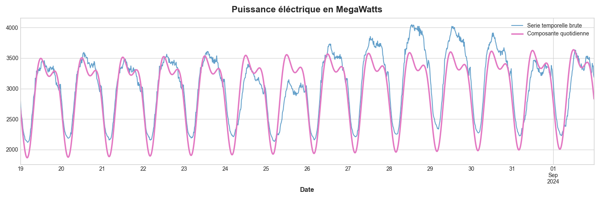
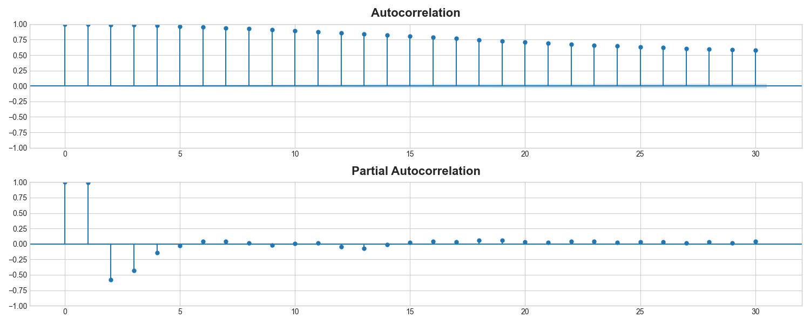
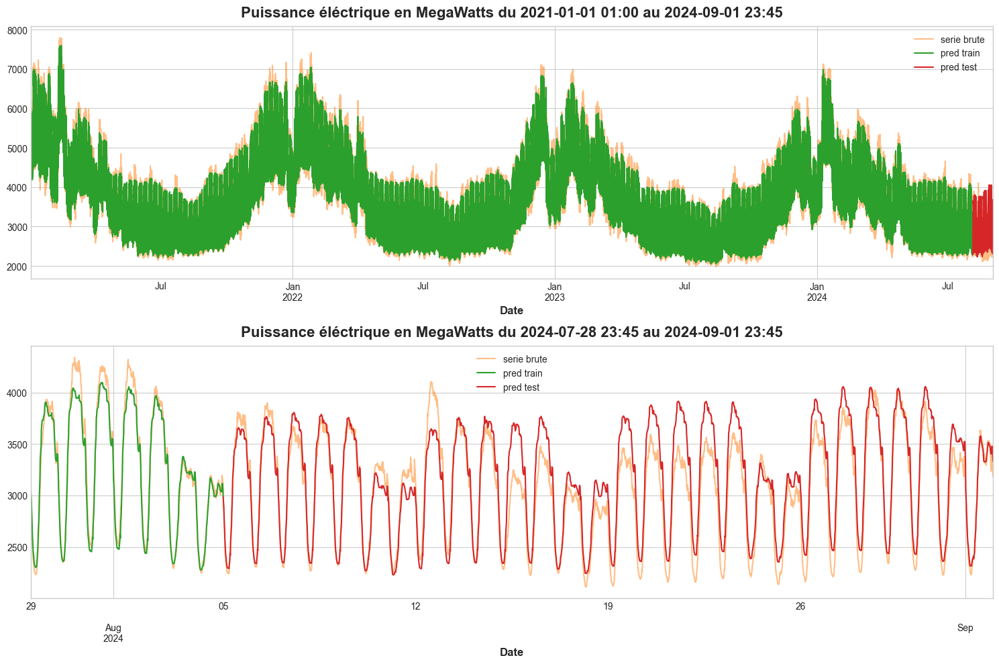

# Analyse de la Consommation Électrique pour la Métropole du Grand Paris

Prévision de la consommation électrique pour la métropole du Grand Paris à l'horizon d'un mois.

## Prérequis
- **Python** 3.8 ou supérieur
- Principales librairies Python utilisées :
  - `pandas` pour la manipulation de données
  - `numpy` pour les opérations numériques
  - `matplotlib` et `seaborn` pour la visualisation
  - `statsmodels` pour la décomposition des séries temporelles
  - `scikit-learn` pour la modélisation et la validation
  - `xgboost` pour les algorithmes de boosting avancés

## Description
Cette étude repose sur l'analyse des données temporelles de consommation électrique dans les métropoles françaises.  
Le dataset provient du site web ODRE Open Data Réseau Énergie. Ce jeu de données présente la consommation réalisée des métropoles au pas de 15 minutes via l'application éCO2mix. Les données sont collectées par télémesures des ouvrages, complétées par des forfaits et estimations.

Caractéristiques du jeu de données : 
- Plage temporelle allant du *1er janvier 2021* au *1er septembre 2024*.
- Échantillonnées toutes les *15 minutes*.
- Consommation électrique en *Mégawatts*.

Lien : [ODRE_Consommation_électrique_des_grandes_Métropoles](https://odre.opendatasoft.com/explore/dataset/eco2mix-metropoles-tr/information/?disjunctive.libelle_metropole&disjunctive.nature&sort=production)

## Objectifs
- Analyser la consommation électrique des métropoles françaises afin d'en extraire les caractéristiques nécessaires aux modèles de Machine Learning de prévision.
- Prévoir la consommation électrique à l'horizon d'un mois.

## Démarche

La métropole du Grand Paris a été choisie à titre d'exemple. La logique reste la même pour traiter les données des autres métropoles.  
Le projet s'articule autour de 3 notebooks Python : 

- **1_Import_Preparation_des_donnees.ipynb** :
  > Cette première étape consiste à importer les données, en modifier la structure afin d'extraire, pour chaque métropole française, les données de consommation.
  > 
  > Détecter et traiter les données manquantes par interpolation.
  >
  > Afficher la série pour obtenir un premier aperçu de celle-ci.

- **2_Analyse_de_la_serie.ipynb** :
  > Une série temporelle $Y_t$ est généralement modélisée par les composantes suivantes : &nbsp;&nbsp;&nbsp;&nbsp; $Y_t = T_t + S_t + R_t$ 
  > - $T_t$ **Tendance** : représente le mouvement global de la série temporelle sur une longue période.
  >
  > - $S_t$ **Saisonnalité** : désigne les fluctuations régulières et prévisibles qui se répètent à des intervalles de temps fixes, comme des jours, des mois ou des années.
  >
  > - $R_t$ **Résidus** : représente la composante aléatoire ou les variations imprévisibles des données.
  >
  > On analyse aussi une éventuelle **dynamique autorégressive** : &nbsp;&nbsp;&nbsp;&nbsp; $Y_t = f(Y_{t-1}, Y_{t-2}, \dots, Y_{t-k})$  
  >
  > C'est-à-dire que la série à l'instant $t$ peut être modélisée en fonction de ses termes précédents s'il y a corrélation entre $Y_t$ et $Y_{t-1}, Y_{t-2}, \dots, Y_{t-k}$.
  >
  > Ce notebook traite l'analyse et l'extraction de ces différentes composantes au sein de notre série temporelle.

- **3_Feature_Engineering_Prediction.ipynb** :
  > Dans cette dernière partie, 2 algorithmes sont testés sur différentes composantes &rarr; *Features* (c'est-à-dire différentes variables $X_1, X_2, \dots, X_p$) :
  > - **Régression linéaire** : $Y_t = \beta_0 + \beta_1 X_1 + \beta_2 X_2 + \dots + \beta_p X_p + \epsilon$.
  >   - $\beta_0$ : Ordonnée à l'origine.
  >   - $\beta_1 , \beta_2 , \dots , \beta_p$ : Coefficients des variables $X_1, X_2, \dots, X_p$.
  >   - Les coefficients $\beta_0, \beta_1 , \beta_2 , \dots , \beta_p$ sont déterminés par minimisation d'une fonction erreur entre les variables $Y_t$ et $Y_{predict}$.
  >
  > - **Algorithme de Boosting** : construit de manière itérative sur un ensemble d'arbres de décision. À chaque itération, XGBoost ajuste les prédictions en appliquant des pondérations plus fortes aux observations avec des erreurs importantes. À la fin de l'entraînement, XGBoost combine les prédictions de tous les arbres pour générer la prédiction finale, offrant ainsi une performance plus robuste et précise qu'un seul arbre de décision.
  >
  > On évalue la performance des deux algorithmes sur les différentes *Features* et on analyse les poids de ces *Features* dans chaque modèle pour sélectionner les meilleures. À l'aide d'une validation croisée, on teste différents hyperparamètres pour améliorer le pouvoir prédictif des modèles. L'algorithme Prophet de Facebook, spécialisé dans la prédiction de séries temporelles, est également testé.

## Composantes du Modèle

### Tendance
La tendance est extraite à l'aide d'une régression linéaire sur l'ensemble des données. On teste une modélisation linéaire, quadratique et cubique et on visualise l'impact sur l'évolution future :

La **tendance linéaire** est retenue pour ce modèle.

### Saisonnalité
Pour identifier la saisonnalité, on retire la tendance de la série temporelle puis on la traite comme un signal périodique en analysant son spectre fréquentiel à l'aide du périodogramme. Deux composantes saisonnières sont identifiées :
- **Composante annuelle** :  

- **Composante quotidienne** :  

### Dynamique Autorégressive
Pour la dynamique autorégressive $Y_t = f(Y_{t-1}, Y_{t-2}, \dots, Y_{t-k})$, on trace et calcule la corrélation entre la série et sa version décalée dans le temps. On utilise l'autocorrélation et l'autocorrélation partielle pour déterminer la force linéaire entre notre série $Y_t$ et ses termes précédents $Y_{t-1}, Y_{t-2}, \dots, Y_{t-k}$.

On retient 4 termes de lags.

### Prédiction
Grâce à l'algorithme de Boosting et aux *Features* sélectionnées, nous obtenons un $R^2 = 0.84$ pour une prédiction sur 4 semaines avec un pas de temps de 15 minutes. 

